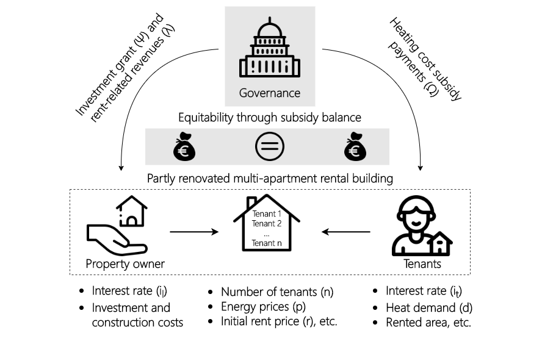

# Equitable decarbonization of heat supply in residential multi-apartment rental buildings: Optimal subsidy allocation between the property owner and tenants

Copyright (c) 2021 Energy Economics Group (EEG), Technische Universität Wien, Sebastian Zwickl-Bernhard

This repository includes materials and methods of the paper published in _Energy and Buildings_.

## Overview & Abstract
The core objective of this work is to demonstrate equitable decarbonization of heat supply in residential multi-apartment rental buildings. A modeling framework is developed determining a socially balanced financial governance support strategy between the property owner and tenants to trigger a heating system change. The results of different decarbonization scenarios of a partly renovated old building switching from gas-fired heat supply to either the district heating network or being equipped with a heat pump system show that an equitable heating system change is possible, but with massive public subsidy payments. Particularly, the investment grant to the property owner and additional rent-related revenues due to building renovation are decisive for the profitability of the investment. Simultaneously, subsidy payments to the tenants are required at the beginning of the investment period to limit their energy and rent-related spendings. Results also show that the heat pump alternative is not competitive compared with district heating, even in case of extensive retrofitting of the building. Allocating the costs of inaction (opportunity costs associated with rising CO2 prices) between the governance, property owner, and tenants turns out as an important lever, as required subsidy payments can be reduced significantly.

	

## Acknowledgement

This package is based on the work initially done in the
[Horizon 2020 openENTRANCE](https://openentrance.eu) project, which aims to  develop,
use and disseminate an open, transparent and integrated  modelling platform
for assessing low-carbon transition pathways in Europe.

Refer to the [openENTRANCE/nomenclature](https://github.com/openENTRANCE/nomenclature)
repository for more information.

This project has received funding from the European Union’s Horizon 2020 research
and innovation programme under grant agreement No. 835896.
