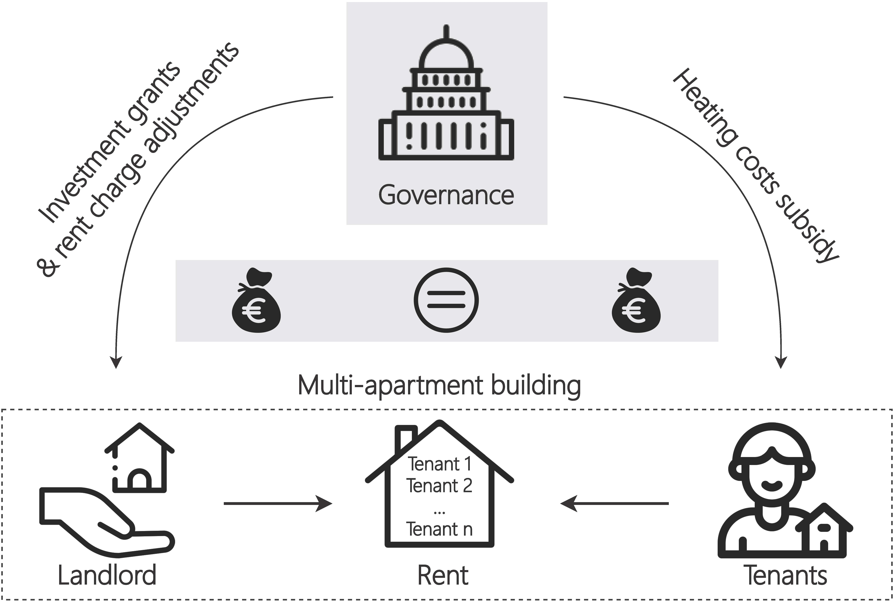

# Justice in decarbonizing the heating system consistent with the Paris Climate Agreement: subsidy balance between landlords and tenants at the multi-apartment building level

Copyright (c) 2021 Energy Economics Group (EEG), Technische Universität Wien, Sebastian Zwickl-Bernhard

This repository includes materials and methods of the paper. A working document of the paper's structure can be found [here](work-doc/Structure-of-the-paper.docx).

# # Current state of the manuscript 
- [x] Introduction
- [x] State of the art
- [x] Methodology
- [x] Results and sensitivity analysis
- [x] Conclusions

# # Overview

	

## Acknowledgement

This package is based on the work initially done in the
[Horizon 2020 openENTRANCE](https://openentrance.eu) project, which aims to  develop,
use and disseminate an open, transparent and integrated  modelling platform
for assessing low-carbon transition pathways in Europe.

Refer to the [openENTRANCE/nomenclature](https://github.com/openENTRANCE/nomenclature)
repository for more information.

This project has received funding from the European Union’s Horizon 2020 research
and innovation programme under grant agreement No. 835896.
